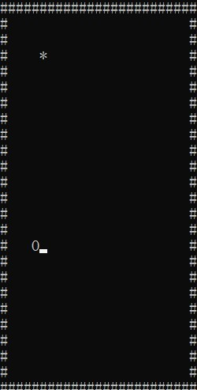
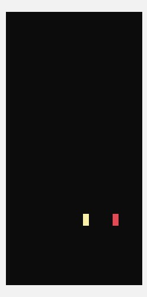
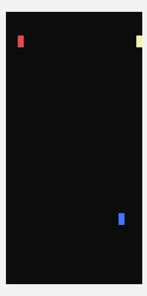

# 北理工汇编大作业——汇编贪吃蛇

## 简介

assembly-snake（汇编贪吃蛇）包含三部分：

* snake.cpp
  最初的成果，使用 C 嵌套汇编编写
* snake.asm
  第二个版本，纯汇编编写
* super-snake.asm
  第三个版本，纯汇编编写，支持单人游戏和双人游戏
  
其中, 在 VS 2019 上配置好运行 C++ 的环境, snake.cpp 可以直接运行

配置好汇编环境, snake.asm 和 super-snake.asm 可以直接运行

## 效果

* snake.cpp 和 snake.asm 的效果如下：
  
  
  
* super-snake.asm 的效果如下：

  * 单人游戏
  
  
  
  * 双人游戏

  
  
## 编写思路
  
关于 assembly-snake.asm 的编写思路，可以查看：[Windows 下 32 位汇编贪吃蛇-李俊霖的网络日志](https://lijunlin2022.github.io/blog/bit-life/snake/index.html)
